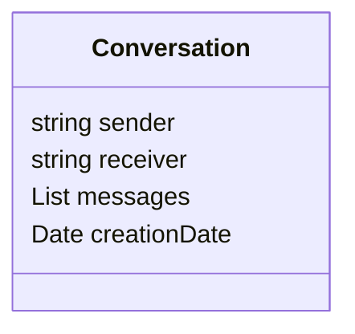
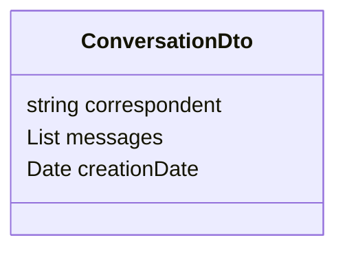
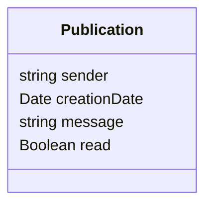
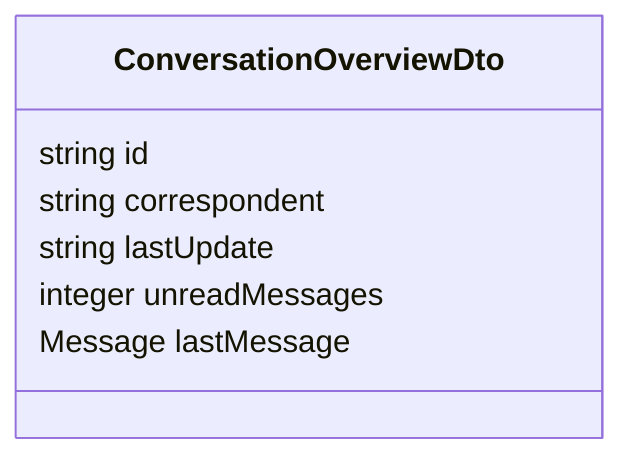

# Analysis for Offers and Requests

## Discussion

Une conversation est une structure dans laquelle seront stockés tous les messages échangés entre deux utilisateurs

1. Il ne peut y avoir qu'une seule conversation entre deux mêmes utilisateurs.
2. Les champs "sender" et "receiver" sont interchangeables du fait du point précédent. Cela indique juste la personne qui a inité la conversation.
3. La liste de messages est ordonnée par date d'envoi (descendant)

Du au second point, on notera que la visualisation d'une conversation par un utilisateur sera légèrement différente.

Le nom du correspondant contiendra soit le nom du sender, soit celui du receiver.

## Message

1. Le champ read sera utilisé pour déterminer si le desinataire du message l'a obtenu.

## ConversationOverview

Afin de faciliter la tâche du front end, une structure "ConversationOverview" a été imaginé pour reprendre les élements clés que l'utilisateur visualisera. Pour avoir toutes les informations, il devra "entrer" dans la conversation en elle même.

1. Le champ unreadMessages contiendra le nombre de messages non lus ("notification visuelle")
2. Le champ lastUpdate contiendra l'heure du dernier message envoyé ou reçu
3. Le champs lastMessage contiendra lui le dernier message, en guise de "preview"

La conversation entière, ainsi que tous les messages qu'elle contient seront accessible par un second appel, utilisant l'identifiant reçu en réponse de cet appel-ci.