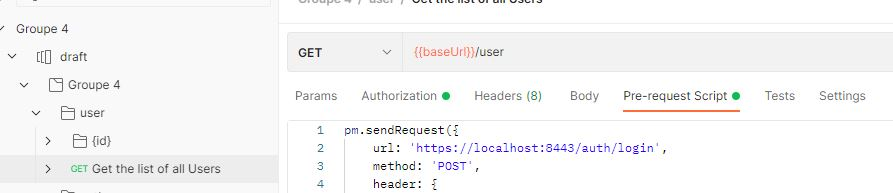

# How to use our swagger in postman

## Import swagger in your workspace

1. File  => import
2. Drag and drop api.yaml from your Java project

> Now you have all the operations and dummy JSON bodies

## Setup automatic call to token

1. Open one operation, for exemple "Get the list of all users"
2. Go under Pre-request script tab



3. Copy/Paste the code below

```
pm.sendRequest({
    url: 'https://localhost:8443/auth/login',
    method: 'POST',
    header: {
        'content-type': 'application/json'
    },
    body: {
        mode: 'raw',
        raw: JSON.stringify({ "username": "jeremy3", "password": "jeremy3"} )
    }
}, (err, res) => pm.collectionVariables.set("TOKEN", res.json().access_token));
```

> Do not forget to set an existing user / password combination

4. Go under Authorization tab and set 

```
Type : Bearer Token
Token : {{TOKEN}}
```

> The pre-request script took the return to the login API and set the access_token under the var TOKEN, which can then be used by writting {{TOKEN}}