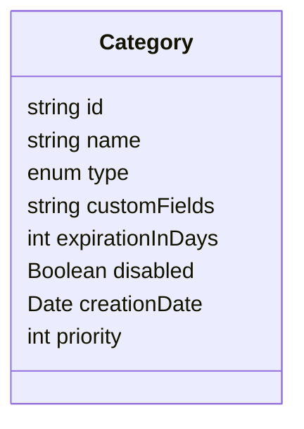
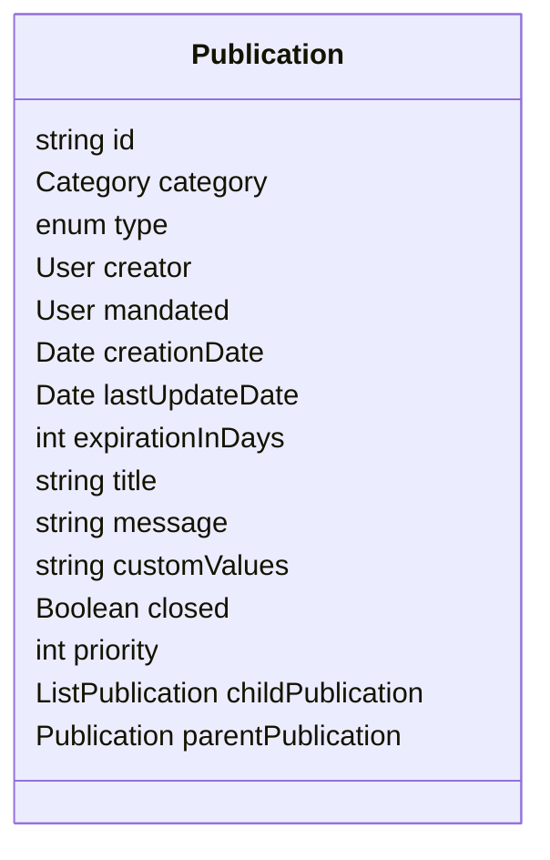

# Analysis for Offers and Requests

## Category

A category is a simple structure use to group Offers and Requests by type, and will also allow field customization.



1. The field **customFields** represent the form that users will have to fill on the UI.

    Ideally it should be a JSON defining the custom fields for the form, like this

    ```
    {
        "location" : "string",
        "contactMail" : "string",
        "limitDate" : "date"
    }
    ```

    This means the front will have to handle this format in the form, and also be able to allow admins to generate such JSON.

2. The field **type** will define if this category is related to offers or to requests.

3. As a category could have new **customFields** over type, it could lead to issues. That's why a category should not be changed (including deletion). But editing an existing category will in fact create a new category with the newest version. The **backend** should only return the last version (there's a timestamp in the **mongo ID** we can use for this purpose, or have a **creationDate** field added)

4. **expirationInDays** field will be used to define if an offer / request will still be visible. Could be overriden by user at creation to a lower value.

    e.g : category "temporary housing", would have a validity of max 7 days. Someone could say : I only want it visible for two days because after that I can stay at my brother's house)

5. **Priority** : number from 1 to 10 to define importance (will be used for display strategy) **OR** String enum with value (might be more relevant for users)

## Publication

Note : an offer and a request will be very similar, but might have different customFields for the same **category**



1. **customValues** correspond to the value entered in the form by the user for the **customFields** of the corresponding category

2. The field **type** will define if this category is related to offers or to requests.

3. **Priority** : number from 1 to 10 to define importance. Will allow used to setup a different priority than the category (lower or higher). Need admin validation if value is higher than category expected value (**to be validate by customer**) **OR** String enum with value (might be more relevant for users)

4. **lastUpdateDate** : we need a simple button to refresh it so user can increase offer duration if needed (any other edit will work too)

5. **childPublication** and **parentPublication** will be used for "complex request" ==> from a request, you will have a button to create a childPublication. On child publication, you will have the parentPublication id. Only 1 parent, but multiple possible child. Probably better to only store the ID

## Access 

- Anyone logged can post a request or an offer, as it is an emergency platform.
  But we coul consider to have a flag displayed on the UI if the user is not validated / account disabled + user tooltip : last log on, distance in km, ...

## Other notes

### Address and localization

- We could have the request / offers linked to one of the user address, or define another address ==> for this we need to add address id
- We do not display address but only provide a distance information ==> but for this we need google maps or something else and I think I'm going way too far

> Simple solution : we have a string user can fill with the location (exact address or not, as he prefer) + address.toString from his address list ?
