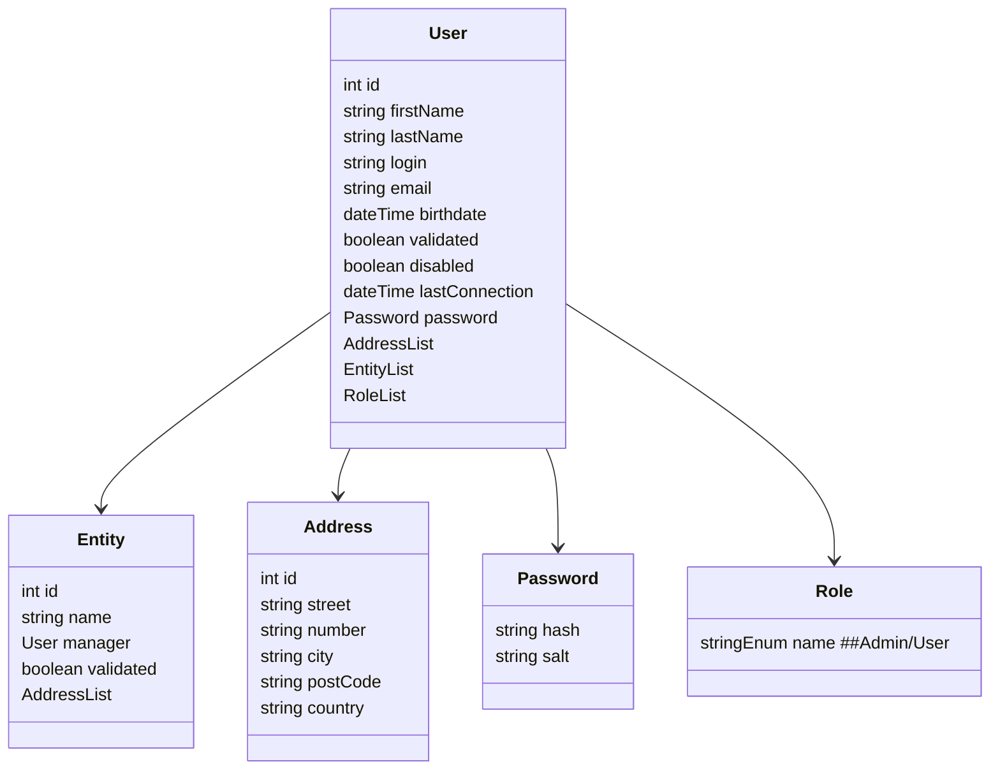
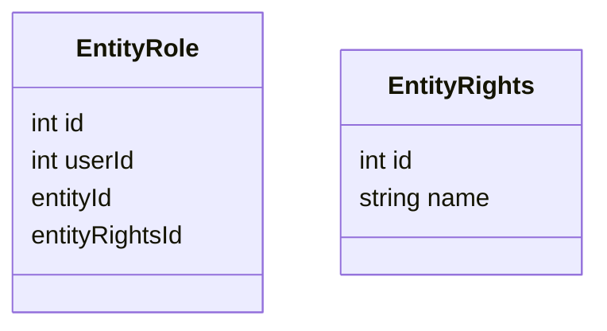

## Notes

- Roles and right must be defined on platform installation (can be done manually first, but config file might be great) : **now we will only consider user / admin roles**

- Potential bonus : handle specific rights inside entity : other option is to consider "any member of an entity have the same right, and only manager have different rights, can have multiple managers



## Operations

1. /user/disable **==> NM**
    - PUT : disable a user, can only be called by user itself
1. /user/enable **==> NM**
    - PUT : enable a user, can only be called by user itself
5. /user/password/ **==> NM**
    - PUT : update user password (user itself)
4. /user/ **==> JDE**
    - GET : get his own data (user itself)
4. /users/ **==> JDE**
    - GET : returns all the users (public info only)
> this here is a change, current version /user/ without param was giving all the users back
6. /user/ **==> JDE**
    - PUT : update user  (user itself only)

### Admin routes

**Must be in a new admin section `AdminUser` in swagger**

1. /admin/user/validate/{id} **==> NM**
    - PUT : validate a user, can only be called by admin
2. /admin/user/disable/{id} **==> NM**
    - PUT : disable a user, can only be called by admin, should be almost identical as route for regular users
3. /admin/user/enable/{id} **==> NM**
    - PUT : enable a user, can only be called by admin, should be almost identical as route for regular users
4. /admin/user/unvalidated **==> NM**
    - GET : get full list of unvalidated unsers, can only be called by admin (for admin page)
5. /admin/user/password/ **==> NM**
    - PUT : update user password (user itself)
> For the last one, I don't think it's right to let the admin update a user password. A procedure for password recovery should be defined

**Same for entity now**

1. /entity/ **==> CLU**
    - GET : get all entities
    - GET {id} : get an entity
    - POST : create an entity (who can do this ? ==> anyone, validation ?==> admin)
    - PUT : update an entity (who can do this ? only entities managers ? )

### Admin routes

**Must be in a new admin section `AdminEntity` in swagger**

1. /admin/entity/unvalidated
    - GET : get full list of unvalidated entity, can only be called by admin (for admin page)
2. /admin/entity/validate/{id}
    - PUT : validate an entity, can only be called by admin

**TODO** : routes relationship entity / user

## Others changes

1. /auth/login
    - Set lastConnectionDate to currentDate  **==> JDE**
2. /auth/register
    - Change fields **==> DONE**

## Roles and auth (==> JDE)

Java sample 

```
import javax.annotation.security.RolesAllowed;
@RolesAllowed("Admin")
```
This will only allow user providing a token having the role "Admin"

~~**TODO** : add roles in JWToken + handle auth in Resources~~

**TODO** : disabled user ==> define procedure, my idea is:
login refused with link to renable account (only if password was right)

