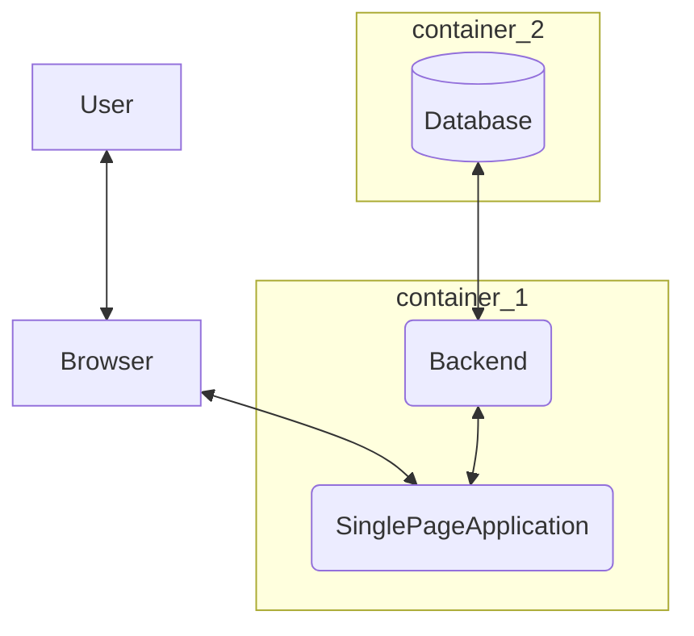

# Introduction LABIL

## Agilité & Git

- Réalisation de **MVP**: Minimum Viable Product
- Calcul du **nombre de sprints disponible**
- **Evolution** du **MVP** entre chaque **sprint**
- Choix des prochaines fonctionnalités du MVP **ensemble** lors d'un **Scrum Meeting**
- **Assignation** des tâches en fin de scrum meeting
   - Aucune tache solo ?
   - Répartition workload ?
   - Domaine d'expertise par personne ? (eg : team front, team back, ...)
- Idéalement **TDD** (Test Driven Development) quand c'est possible
- Choix des prochaines fonctionnalité un sprint en avance
- Analyse pour le sprint +1 durant le sprint en cours
- Découpage des tâches (**WBS**) pour le sprint +1 durant le sprint en cours

## Organisation des Scrum Meetings

- Présentation du MVP (par le scrum master) (5 minutes)
- Retrospective (10 minutes)
- Rappel du MVP cible (5 minutes)
- Présentation du WBS pour le prochain Sprint (10 minutes)
- Définition du prochain MVP (sprint +1) (20 minutes)
- Q&A libre (/)

**Le scrum master jouera également le role de Product Owner, et sera responsable de préparer le meeting et fournir un "meeting minute"**

## Proposition d'architecture

Schéma habituel des applications modernes.

## Technologies

> Ces technologies sont réfléchies pour être simples d'accès, modernes et open source.

### Core

| Composant | Technologie |
| --------- | ----------- |
| SPA       | React Native (si mobile) ou React JS      |
| Backend   | Quarkus     |
| Database  | CockroachDB / MongoDB ? |

### Outils

| Composant                      | Technologie      | Utilité                                                                           |
| ------------------------------ | ---------------- | --------------------------------------------------------------------------------- |
| Ticket Management              | GitHub           | Créer les tickets et les milestones (MVP), tracking                                 |
| Gestion des spécifications API | OpenApiGenerator | Cadrer et minimiser la production de code concernant les modalités d'interactions |
| ORM                            | Hibernates       | Faciliter les interactions SQL entre la DB et le Backend                          |
| Container management           | DockerDesktop    | Facilement créer des containers sur windows                                       |

Pour vous aider dans votre travail, je vous conseille également:

- GitHub Desktop pour simplifier vos interactions avec Git
- StopLight OpenAPI pour créer des contrats openapi facilement
- Postman pour tester le backend simplement
- VSCode ou IntelliJ pour coder
- Discord pour les communications + Teams réunion

Il existe également des outils dont l'usage coule de source comme:

- Git
- JDK 11
- Maven
- ...

## Challenges principaux et Solutions

- Gérer les personnes connectées au site
  - Quarkus authentication via Encrypted Cookies
- GDPR compliance
  - TO DO

> Autres points à définir

## Documentation

Tout point du projet devra faire l'objet d'une documentation de qualité.
Il peut s'agir de documentation sur des points divers, tels que :

- Setup d'un outil
- Utilisation de notre plateforme (destination : utilisateurs finaux)
- Choix pour notre plateforme (e.g : outils, implémentation)
  - Avantages
  - Inconvénients
  - Justification du choix
- Proof Of Concept, Test Report
