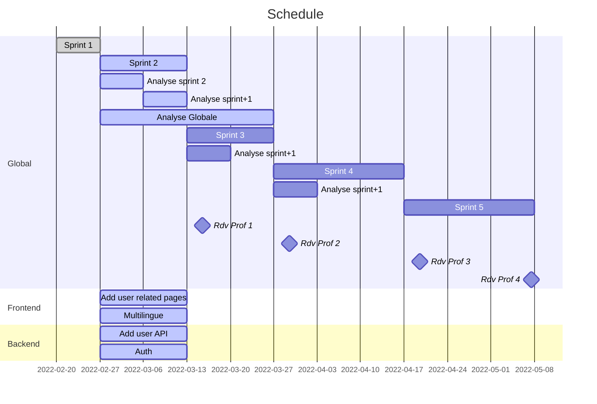

# Sprint review n°1

## MVP 0

Le premier MVP ne concerne pas vraiment la création de contenu mais plutot que tout le monde ai un environement de travail correctement établi et puisse faire démarrer l'application à vide. Chaque participant devra également comprendre les spéficiations et proposer des solutions.

Objectif du MVP

- Chaque participant possède:
  - Checkout Projet
  - IDE (IntelliJ / CodeJS)
  - JDK 17 setup (path)
  - Docker desktop

<nl>

- Chaque participant devra: 
  - Avoir pris connaissance des spécifications (si pas déjà fait)
  - Proposer des tâches / solutions pour le MVP suivant, avec analyse (partielle ou complète)

<nl> 

- Le setup des outils se fera lors du meeting de clôture du MVP 0, collectivement.

## Rétrospective

5 des 6 membres ont l'installation en place, le 6eme termine dans la journée.

## Prochain MVP

- Début d'écriture des spécifications globales de la plateforme
  - User Story
  - Diagrammes
  - etc
- Mise en place du token pour la communication frontend/backend et gestion des droits
- Page de login (frontend)
- API simpliste pour les utilisateurs (backend)
- Interface web pour les utilisateurs (frontend)
- Début de réflexion sur l'approche multilingue
- Documentation/analyse relative aux points précédents

## WBS

A defnir plus précisement par les équipes sur base du MVP

## Schedule

## Remarques

Besoin d'une vision plus globale, d'un début d'analyse des fonctionnalités de l'application.

