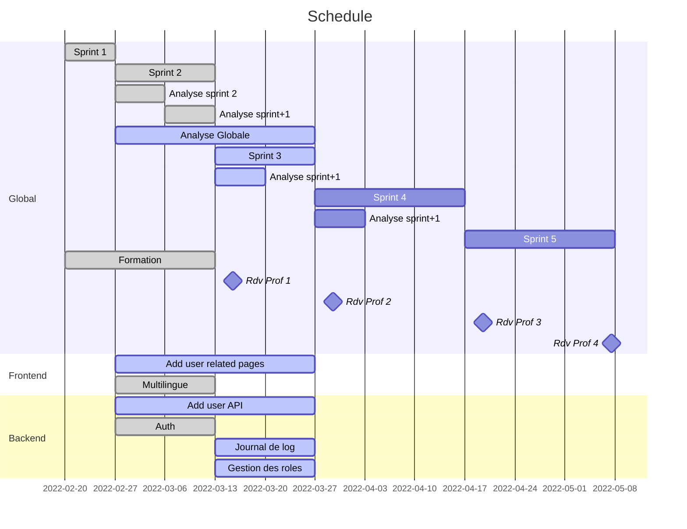

# Sprint review n°2

## MVP 1

- Début d'écriture des spécifications globales de la plateforme
  - User Story
  - Diagrammes
  - etc
- Mise en place du token pour la communication frontend/backend et gestion des droits
- Page de login (frontend)
- API simpliste pour les utilisateurs (backend)
- Interface web pour les utilisateurs (frontend)
- Début de réflexion sur l'approche multilingue
- Documentation/analyse relative aux points précédents

## Rétrospective

- Swagger a corriger/améliorer pour l'auth (flag)

### Reporté

- API simpliste pour les utilisateurs (backend)
- Interface web pour les utilisateurs (frontend)

## Objectif meeting 

 - Discuter de ce qu'on rend 
    - Doc 1 : Rapport meeting (JDE)
    - Doc 2 : Analyse et co (CLU)
 - Discuter de la présentation
    - 1 video de ce qui marche déjà : page login + postman (JST)
    - Presenter analyse
      - Outils (Quarkus,...) : JST
      - Securité : JDE
      - Fonctionnelle : 
         - Traduction : ABA
         - Analyse (cf diagrams) : CLU
    - Presenter ce qui est fait & organisationnel : ABA
 - Définir les prochains points (cf : analyse documents teams)

## Prochain MVP

### Urgent : target mardi
- Use case :
  - Liés aux utilisateurs (Michel)
- Diagramme de classe :
  - Utilisateur et ses liens : e.g : entité (?)

### Normal

- API simpliste pour les utilisateurs (backend) : Michel - CLU - JDE : Samedi 11h 
- Interface web pour les utilisateurs (frontend) : ABA - JST
  - Page register
  - ... (a definir) ...
- Gestion roles user : TBD
- Journal de log (JST)
- Analyse (use case & co) : demandes et offres (ABA)

## Idées futures

- "Maintenance mode" avec message d'alerte possible

## WBS

A defnir plus précisement par les équipes sur base du MVP

## Schedule

