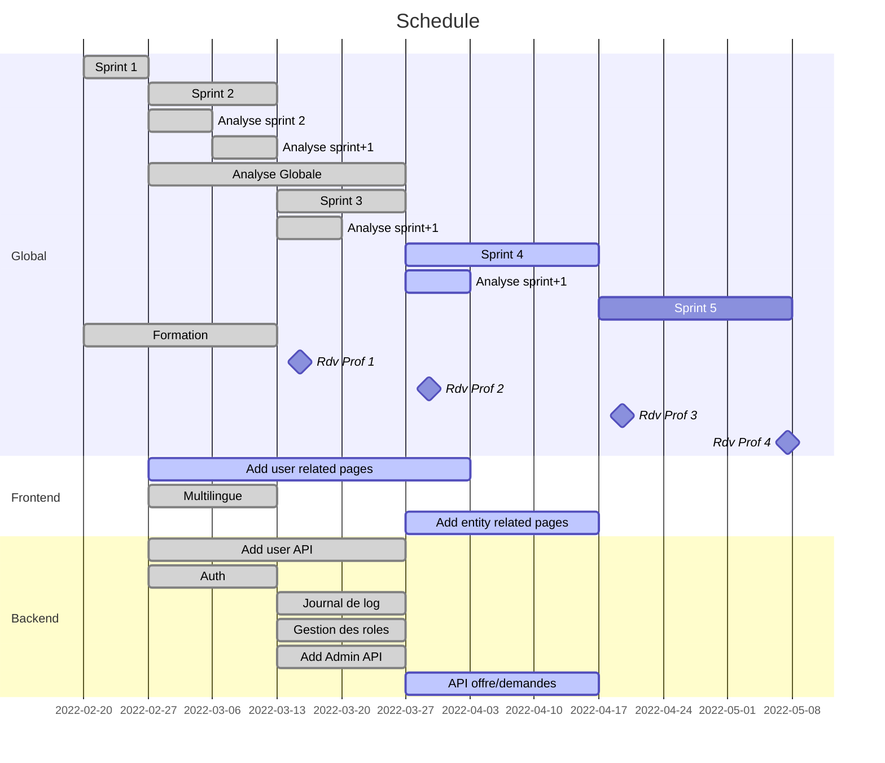

# Sprint review n°3

## MVP 2

- Use case :
  - Liés aux utilisateurs (Michel)
- Diagramme de classe :
  - Utilisateur et ses liens : e.g : entité (?)
- API simpliste pour les utilisateurs (backend) : Michel - CLU - JDE : Samedi 11h 
- Interface web pour les utilisateurs (frontend) : ABA - JST
  - Page register
  - ... (a definir) ...
- Gestion roles user : TBD
- Journal de log (JST)
- Analyse (use case & co) : demandes et offres (ABA)

## Rétrospective

- Analyse (use case & co) : demandes et offres (JDE-ABA) **OK**
- Journal de log (JST)  **OK**
- API simpliste pour les utilisateurs (backend) :
    - Gestion roles user (JDE) **OK**
    - Admin routes (NM)  **OK**
    - Entity routes (CLU) **OK**
- Interface web pour les utilisateurs (frontend) : ABA - JST
  - Page register **En cours**
  - User preference **En cours**
  - ... (a definir) ...

### Reporté

- Interface web pour les utilisateurs (frontend)

## Objectif meeting 

- Discuter de ce qu'on rend 
- Discuter de la situation
- Discuter de la présentation
- Définir les prochains points (cf : analyse documents teams)

## Delivrables

- Pas d'image docker, changements uniquement sur le backend, peu intéressant à fournir sans l'implémentation coté frontend
- Document analyse : ABA 
- Document projet : JDE

## MVP3 

- Mockup pages web (frontend) : ABA
- Interface web pour les utilisateurs (frontend) : ABA - JST
  - Page register
  - User preference
  - ... (a definir) ...
- Interface web pour les entités (frontend) : ABA - JST
  - Page creation
  - Validation par admin
  - ... (a definir) ...
- API Offres/demandes et catégories
  - Definir les routes : NM - CLU
  - Créer l'API : NM - CLU
  - Tester une méthode de stockage d'objets "dynamiques" qui permettrait aux catégories d'avoir des champs différents, avec outils de création de catégorie : JDE

## Idées futures

- "Maintenance mode" avec message d'alerte possible

## Schedule

