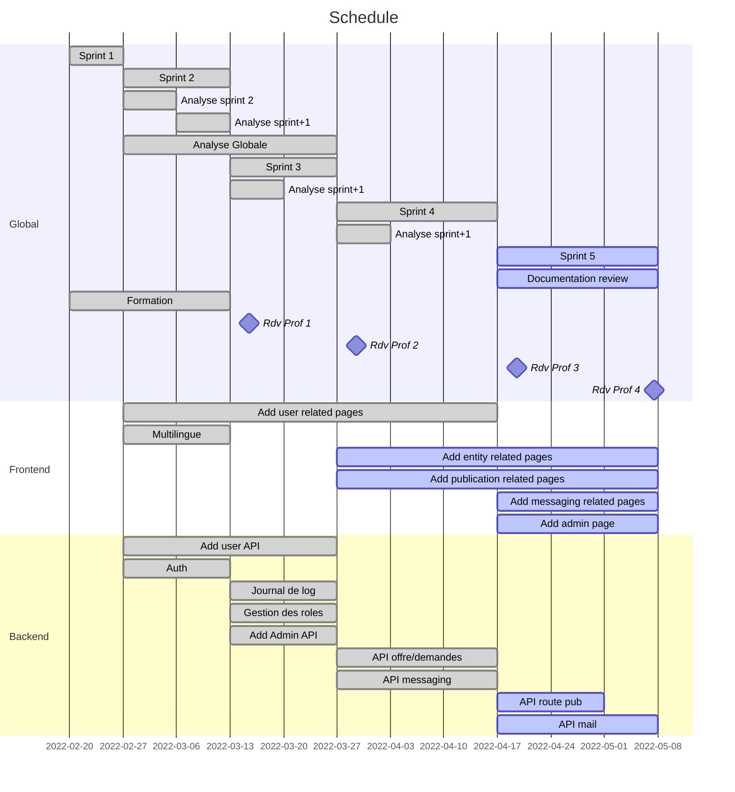

# Sprint review n°4

## MVP 3

- Mockup pages web (frontend) : ABA
- Interface web pour les utilisateurs (frontend) : ABA - JST
  - Page register
  - User preference
  - ... (a definir) ...
- Interface web pour les entités (frontend) : ABA - JST
  - Page creation
  - Validation par admin
  - ... (a definir) ...
- API Offres/demandes et catégories
  - Definir les routes : NM - CLU
  - Créer l'API : NM - CLU
  - Tester une méthode de stockage d'objets "dynamiques" qui permettrait aux catégories d'avoir des champs différents, avec outils de création de catégorie : JDE

### Ajout en cours de sprint

- API messaging (communication entre utilisateurs) : JDE
  - définir les routes
  - implémentation API
  - test
- API Offres/demandes et catégories
  - "matching strategy" : JDE

## Rétrospective

- API Offres/demandes et catégories : **done**
- API messaging : **done**
- Interface web pour les utilisateurs : **done**
- Interface web pour les entités (frontend) : **reporté**
- Mockup pages web (frontend) : **partiel**

### Reporté

- Interface web pour les entités

## Objectif meeting 

- Discuter de ce qu'on rend 
- Discuter de la situation
- Discuter de la présentation
- Définir le produit final

## Delivrables

- Image docker : JST
- Document analyse : ABA 
- Document projet : JDE
- Vidéo démonstration : JDE (backend only)
- Support présentation : ABA

## MVP 4

- Interface web pour les publications (offres/demandes) (frontend)
- Interface web pour la messagerie (offres/demandes) (frontend)
- Interface web l'admin (frontend)
- Revoir documentation existante (rapport solution) : **tout le monde**
- Plus de nouvelle fonctionnalité backend
  - sauf corrections / nouvelles opérations sur objets existants
  - forget password ==> email ? **JDE**
  - Routes get publication by user / by type ==> offres / demandes  **JDE**

### Nice to have

- Interface web pour les entités (frontend) : **report**

## Idées futures

- "Maintenance mode" avec message d'alerte possible

## Schedule

