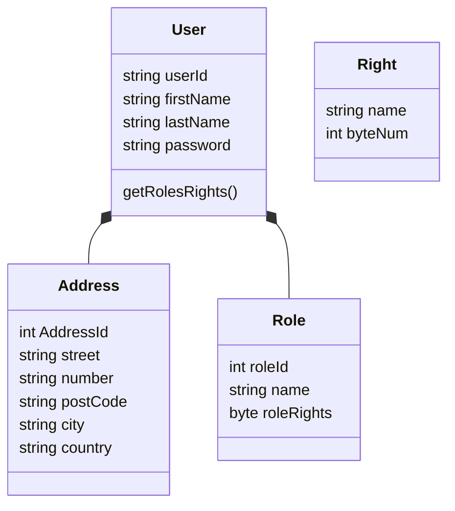

## Analyse

### Points importants
- Open source ==> done
- multi lingue !
- authentification (section 4.1 + 6)
  - roles 'techniques' (admin) 
  - roles users (section 6.4)
- securité (RGPD / encrpytion / auth technique + identification des personnes (KYC) : carte d'identité, itsme, permis de conduire, ... )

==> qui se charge de quelle partie d'analyse ?

### Analyse user / roles 

* ***roleRights*** : système de bit comme AD ?
==> a définir quels peuvent être les droits

|Read|Write|Delete|Final Right
|-|-|-|-|
|1|1|1|7|
|1|0|1|5|

* ***getRolesRights()*** : retourne concat droits de tous les roles ?
* **Danger** : table right doit etre très secure, pas spécialement utile en vrai
* **Point important** : Peut on delete ? Ou doit on garder un historique ? (e.g : je change d'addresse, le système garde l'ancienne en mémoire ?)

### Gestion technique 

- Utilisation de token
- Gestion droits coté backend ?
- Token nécessite TLS ?
- Token contient le userId, le token contient aussi les roles/rights