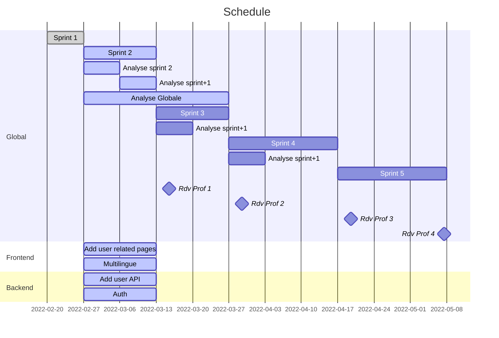

# Organisation groupe 4

## Introduction

Le but de ce document sera dans un premier temps de décrire l'organisation de notre groupe. Dans un second temps, de retranscrire en toute transparence les résultats de nos meetings, nos avancées, nos éventuels problèmes ainsi que nos décisions quant à la découpe du travail.

## Agilité & Git

- Réalisation de **MVP**: Minimum Viable Product
- Calcul du **nombre de sprints disponible**
- **Evolution** du **MVP** entre chaque **sprint**
- Choix des prochaines fonctionnalités du MVP **ensemble** lors d'un **Scrum Meeting**
- **Assignation** des tâches en fin de scrum meeting
   - Aucune tache solo
   - Répartition workload par équipe
   - Domaine d'expertise par personne (eg : team front, team back, ...)
- Idéalement **TDD** (Test Driven Development) quand c'est possible
- Choix des prochaines fonctionnalité un sprint en avance
- Analyse pour le sprint +1 durant le sprint en cours
- Découpage des tâches (**WBS**) pour le sprint +1 durant le sprint en cours

## Organisation des Scrum Meetings

- Présentation du MVP (par le scrum master) (5 minutes)
- Retrospective (10 minutes)
- Rappel du MVP cible (5 minutes)
- Présentation du WBS pour le prochain Sprint (10 minutes)
- Définition du prochain MVP (sprint +1) (20 minutes)
- Q&A libre (/)

# Kickoff meeting

## Objectifs du meeting

1. Présentation des membres (2 min / personne, aspect technique + caractère)
1. Organisation : meeting, roles, scrum
1. Technologies et architecture : draft + discussions
1. Definition premier sprint
1. Definition roles

## Meeting minutes

### Membres

| Nom | Expertise | Caractère |
| --------- | ----------- | --------- |
| Jeremy    | Integration   WebService   Architecture   PM   Déteste front end | Exigeant    Franc parlé   Aime débattre |
| Johan | Integration   Full stack : Java / Angular   Architecture   Python | Aime le code propre |
| Corentin | Ingenieur civil en méchanique   Automate   PM | Perfectioniste   Débat |
| Aquilain | Test performance / charge   Pas expert dev   front end ok | calme   si ca fonctionne ca fonctionne |
| Issam | Java et autre   C/C++   html, css | calme   ouvert   directe |
| Michel | Helpdesk   Dev .NET technofutur : Java Spring   Front end (technofutur), angular base | calme   orienté solution |

### Equipes

Nous avons identifié 3 équipes pour débuter le projet :

| Equipe | Membre |
| --------- | ----------- |
| Front-end    | Aquilain   Johan | 
| Back-end    | Jeremy   Michel | 
| Flexibles    | Corentin   Issam | 

*Les personnes flexibles travailleront sur les deux aspects, renforcant temporairairement les équipes de base.* 

*Pour les autres, les équipes ne sont pas cloisonnées et tout membre peut devenir flexible si besoin/envie*

### Schedule

Le premier sprint sera très court car assez simple.
L'échéance est fixée à une semaine.

Les autres sprint seront plus longs (2 à 3 semaines), nous proposons l'organisation suivante :

## Schedule

### MVP 0

Le premier MVP ne concerne pas vraiment la création de contenu mais plutot que tout le monde ai un environement de travail correctement établi et puisse faire démarrer l'application à vide. Chaque participant devra également comprendre les spéficiations et proposer des solutions.

Objectif du MVP

- Chaque participant possède:
  - Checkout Projet
  - IDE (IntelliJ / CodeJS)
  - JDK 17 setup (path)
  - Docker desktop

<nl>

- Chaque participant devra: 
  - Avoir pris connaissance des spécifications (si pas déjà fait)
  - Proposer des tâches / solutions pour le MVP suivant, avec analyse (partielle ou complète)

<nl> 

- Le setup des outils se fera lors du meeting de clôture du MVP 0, collectivement.

# Sprint review n°1

## Rétrospective

- 5 des 6 membres ont l'installation en place, le 6eme termine dans la journée
- Besoin d'une vision plus globale, d'un début d'analyse des fonctionnalités de l'application.

## Prochain MVP

- Début d'écriture des spécifications globales de la plateforme
  - User Story
  - Diagrammes
  - etc
- Mise en place du token pour la communication frontend/backend et gestion des droits
- Page de login (frontend)
- API simpliste pour les utilisateurs (backend)
- Interface web pour les utilisateurs (frontend)
- Début de réflexion sur l'approche multilingue
- Documentation/analyse relative aux points précédents

## WBS

A defnir plus précisement par les équipes sur base du MVP

# Sprint review n°2

## Rétrospective

- Swagger a corriger/améliorer pour l'auth (flag)

### Taches reportées

- API simpliste pour les utilisateurs (backend)
- Interface web pour les utilisateurs (frontend)

## Objectif meeting 

 - Discuter de ce qu'on rend 
 - Discuter de la présentation
 - Définir les prochains points (cf : analyse documents teams)

 ## Meeting minutes

 - Ce qu'on rend 
    - Doc 1 : Rapport meeting (JDE)
    - Doc 2 : Analyse et co (CLU)
 - Présentation
    - 1 video de ce qui marche déjà : page login + postman (JST)
    - Presenter analyse
      - Outils (Quarkus,...) : JST
      - Securité : JDE
      - Fonctionnelle : 
         - Traduction : ABA
         - Analyse (cf diagrams) : CLU
    - Presenter ce qui est fait & organisationnel : ABA
 - Définir les prochains points (cf : analyse documents teams)

## Prochain MVP

### Urgent : target mardi
- Use case :
  - Liés aux utilisateurs (Michel)
- Diagramme de classe :
  - Utilisateur et ses liens : e.g : entité (?)

### Normal

- API simpliste pour les utilisateurs (backend) : Michel - CLU - JDE : Samedi 11h 
- Interface web pour les utilisateurs (frontend) : ABA - JST
  - Page register
  - ... (a definir) ...
- Gestion roles user : **A definir**
- Journal de log (JST)
- Analyse (use case & co) : demandes et offres (ABA)

## Idées futures

- "Maintenance mode" avec message d'alerte possible

## WBS

A defnir plus précisement par les équipes sur base du MVP
