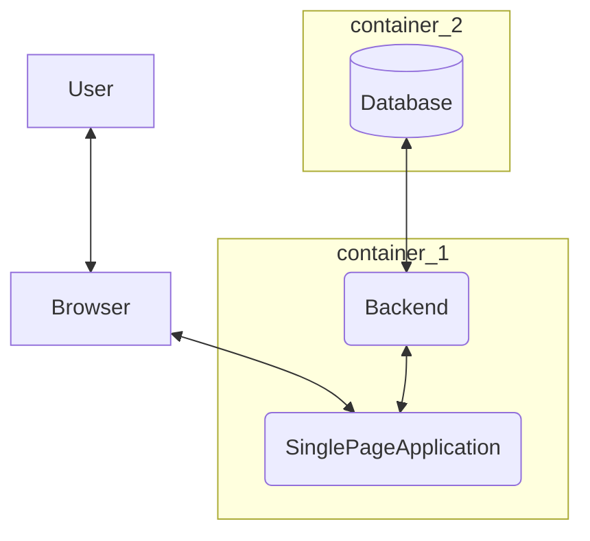

# Définition des besoins architecturaux

Sans entrer dans le détail de la conception, nous pouvons déjà identifier des grands points sur le design de notre plateforme.

Pour rappel, l'objectif est de fournir une plateforme d'entraide citoyenne pour des situation de catastrophes (naturelles, sanitaires, autres). 

## Security

Les personnes seront amenées à fournir des données personnelles à la plateforme. Ces données peuvent être relativement peu confidentielle, telle qu'une addresse, ou des documents officiels permettant de prouver l'identité des utilisateurs. 

Dès lors, un niveau suffisant de sécurité sera nécessaire, notamment sur les aspects suivants :

- Chiffrement : toute communication devra être sécurisée (TLS / HTTPS). Il ne sera pas nécessaire d'utiliser un mécanisme avancé d'encryption, nous nous contenterons des recommandations d'organismes tel que l'ANSSI dans **anssi-guide-recommandations_de_securite_relatives_a_tls-v1.2.pdf** (https://www.ssi.gouv.fr/guide/recommandations-de-securite-relatives-a-tls/)

  - TLS 1.2 / 1.3 : TLS 1.1 est considéré comme obsolète, TLS 1.3 est recommandé mais il est conseillé de garder la possibilité d'accepter des connections TLS 1.2.
  - Suite cryptographique

|  Code TLS | Suite cryptographique |
| --------- | ----------- |
| 0xC02C | TLS_ECDHE_ECDSA_WITH_AES_256_GCM_SHA384 |
| 0xC02B | TLS_ECDHE_ECDSA_WITH_AES_128_GCM_SHA256 |
| 0xC0AD | TLS_ECDHE_ECDSA_WITH_AES_256_CCM |
| 0xC0AC | TLS_ECDHE_ECDSA_WITH_AES_128_CCM |
| 0xCCA9 | TLS_ECDHE_ECDSA_WITH_CHACHA20_POLY1305_SHA256 |

*Suites TLS 1.2 recommandées avec un serveur disposant d’un certificat
avec clé publique ECDSA*

|  Code TLS | Suite cryptographique |
| --------- | ----------- |
| 0x1302 | TLS_AES_256_GCM_SHA384 |
| 0x1301 | TLS_AES_128_GCM_SHA256 |
| 0x1304 | TLS_AES_128_CCM_SHA256 |
| 0x1303 | TLS_CHACHA20_POLY1305_SHA256 |
*Suites TLS 1.3 recommandées*

On notera aussi deux autres aspects secondaires, à savoir :

- Le chiffrement des mot de passe
- La reglementation RGPD

Ces points seront abordés dans les sections impactées dans la suite du document

## Performances

Le cycle de vie de cette aplication sera  probablement très court, pour répondre à un besoin d'urgence. Dès lors, la plateform devra pouvoir supporter une charge très élevée à un moment donné. Il sera important que ces performances puissent être aisément et rapidement adaptées au besoin.

Il faudra donc que notre application soit **scalable**. Il existe deux modes distinct, l'**horizontal scaling** et le **vertical scaling**.

- Vertical scaling : fait de rajouter des resources matérielles pour augmenter les performances
- Horizontal scaling : fait de rajouter des **noeuds** ou **machine** dans une infrastructure.

L'horizontal scaling à comme avantage de ne pas avoir de limite physique matérielle. Il existe une limite physique sur les serveurs qui sont largement excédées par des systèmes actuels. Néanmoins, il nécessite des précautions particulières lors du développement.

Le vertical scaling à l'avantage de ne pas nécessiter d'adaptations particulières du logiciel. Néanmoins, il ne suffit plus aux besoins actuels et ne serait donc pas un bon choix dans le cadre de ce projet.

L'horizontal scaling sera donc notre choix, et sera particulièrement facile à appliquer grace à la création d'images **docker**. Le système pourra être adapté en modifiant simplement le **docker compose**.

## Availability

Comme cité au point précédent, l'objectif sera de répondre à une situation d'urgence. Dès lors, toute indisponibilité de la plateform pourrait mener à des conséquences assez lourdes et ainsi ne pas répondre au besoin.

Néanmoins, des indisponibilité très courtes seront tolérées, et il ne sera pas nécessaire d'implémenter un système garantissant une disponibilité totale, comme on pourrait le rencontrer dans les domains de l'aviation civil ou le domaine militaire.

La gestion de la disponibilité sera également couverte grace à l'**horizontal scaling**, qui nécessite que le système soit un **système distribué**. La réplication des services sur plusieurs serveurs garanti donc une meilleure disponibilité.

Il sera important de noter que cette notion devra être présente à tous les niveaux de l'application, afin d'éviter tout **single point of failure**.

Le choix de la géoredondance et de la gestion des data center sera décidé par l'organisme déployant la plateforme. Néanmoins, nous ne pouvons que recommander de suivre les normes en la matière.

## Maintainability

Le projet étant un projet open source, destiné à être déployé par des personnes tièrces impliquera des besoins spécifiques.

- Documentation : 
  - Technique : Une documentation concernant la paramétrisation de l'application sera essentielle
  - Code : Le code devra être commenté, aéré et lisible. 
  - Utilisateur : Les fonctionnalités du point de vue utilisateur devront être documenté afin de faciliter l'usage de la plateforme. 

- La généricité :
  - Le code devra être spécifiquement réfléchis afin que d'autres développeurs puissent ajouter des modules. L'utilisation d'interfaces Java pourra par exemple permettre un certain niveau d'abstraction nécéssitant peu de changements pour ajouter de nouvelles fonctionnalités.

- Logs : 
  - L'application devra obligatoirement avoir des journaux de logs afin de pouvoir identifier toute action ayant été effectuée
  - Une gestion d'erreur et une standardisation des logs (e.g : Log4j) sera également très importante pour aider à la résolution de problèmes.

# Proposition d'architecture

Voici un schéma simplifié choisi dans le cadre de notre projet.

Ce dernier est classique et utilisé dans de nombreux framework modernes.

- Le container 1 pourrait être subdivisé en deux containers si le besoin s'en fait ressentir. Cela n'impactera pas le fonctionnement de l'application. 
- Le container 2 contenant la base de donnée devrait optimalement contenir une des deux options suivantes afin de garantir un certain niveau de disponibilité :
  - Une Database distribuée, telle que CockroachDB (PostgreSQL)
  - Un Cluster de database 
  - Préférablement un DB adaptée aux gros volumes, telles que les DB **NoSQL**

## Technologies principales

Ces technologies sont réfléchies pour être simples d'accès, modernes et open source.

| Composant | Technologie |
| --------- | ----------- |
| Single Page Application  | React Native       |
| Backend   | Quarkus     |
| Database  | CockroachDB / MongoDB |

**Quarkus** 

Nous avons choisi d'utiliser Quarkus pour de nombreuses raisons. Tout d'abord, Quarkus est très similaire à **Java SpingBoot**, mais à l'avantage d'être plus léger, plus optimisé pour l'exécution en conteneurs, et vient avec des fonctionnalités additionnelles telle qu'une compilation en "live" lors de tout changement.

De plus, nous avions envie d'apprendre ce framework afin de pouvoir nous en faire une meilleure opinion.

**React Native** 

Nous avions évoqués de nombreuses options pour cette partie, telles qu'**Angular**, **ReactJS**, **Vue.js**.

Notre choix s'est porté sur **React Native** afin de profiter de la fonctionnalité d'export sous forme d'application pour smartphone, qui ne nécéssite aucune configuration ou même build particulier.

Un Proof Of Concept (POC) a été réalisé afin de valider ce choix. L'objectif était d'évaluer la difficulté de produire du code, et cet aspect ne diffère pas comparé aux autres framework cités précédemment.

**Database** 

Pour les base de données, nous avions identifiés plusieurs besoins potentiels :

- Disponibilité : possibilité de distribution / clusterisation
- Performance : choisir une solution pouvant supporter une charge élevée
- Gestion d'objet JSON : l'objectif serait de pouvoir stocker des structures customisées par les administrateurs de la plateforme. Ainsi, les modèles d'objets pourraient être customisés et ne pas dépendre d'une structure forte en base de donnée.

## Technologies secondaires

Certaines technologies additionnelles seront requises la communication entre les différents composants.

### API et contrat

Afin de communiquer entre le **frontend** et le **backend**, il sera nécessaire pour les deux parties de s'accorder sur le format des messages échangés.
Nous choisiront le standard **REST**, un standard dans l'industrie.

Afin d'établir un contrat, le backend présentera ses opérations sous forme d'**API REST**, avec la mise à disposition du contrat sous forme de **Swagger** (OpenApi)

### JWToken

Un élement essentiel dans la communication entre le **frontend** et le **backend** est la gestion de droits. En effet, les utilisateurs devront s'**authentifier**, auront des **droits** et auront une notion de **session**.

Ces aspects seront géré grâce au standard **JWToken**.

Pour plus d'informations, voir : https://jwt.io/introduction ou https://datatracker.ietf.org/doc/html/rfc7519