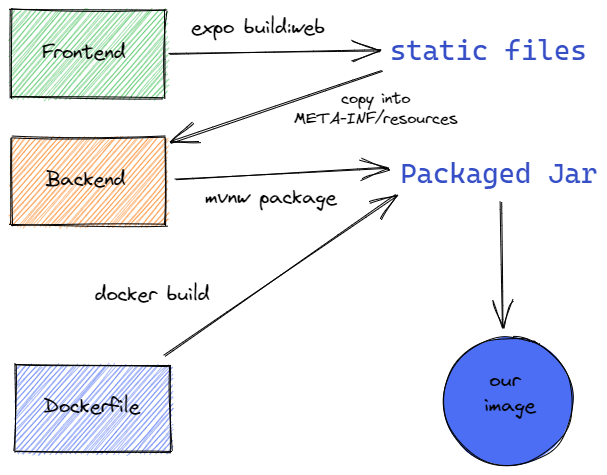

# Prepare and run the application

Ready to go live ? Or you want to try your application directly in a container ?
This guide is exactly the one you need.

The guide is devided in 2 sections. A first one for build the application and a second for the deployment.

> We provide support from docker image artifact only

## Build

Currently, the build of the application is not so easy.
Nothing really difficult but a lot of small steps haven't been automated.

In order for you understand the process, you can have a look on this schema which resume correctly what you have to do in order to build the image of the application.



And now here is the cookbook for creating your image

1. go to `src/main/front` and build the web application. As it's a javascript framework, we transform our code into a bunch of static files.
   The command is `expo build:web`. It will create our files into `src/main/front/web-build`

2. Copy the content of `src/main/front/web-build` and drop it into `src/main/resources/META-INF/resources`. At this stage quarkus is serving your website by itself.

3. go back in the root of your directory and execute `mvnw package` in order to package your application in a jar with the website into it.

4. run `docker build -f src/main/docker/Dockerfile.jvm -t quarkus/groupe4-jvm .` in order to create the iage for your application. The image name il `quakus/groupe4-jvm`

at the end, you should have done something like that:

```bash
# From project root
PROJECT_ROOT=$(pwd)
cd src/main/front
expo build:web
cd $PROJECT_ROOT
cp src/main/front/web-build src/main/resources/META-INF/resources
./mvnw package
docker build -f src/main/docker/Dockerfile.jvm -t quarkus/groupe4-jvm .
```

We planned to script it but it's not a top priority.

## Deployment

## Customizing application properties
